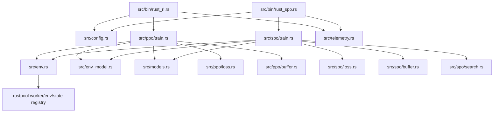

# Architecture

This document defines crate boundaries, dependency direction, and cross-module contracts for both algorithms:

- PPO (`rust_rl` binary)
- SPO (`rust_spo` binary)

For runtime step-by-step execution details, see:

- PPO: [training-loop.md](training-loop.md)
- SPO: [spo-training-loop.md](spo-training-loop.md)

## Crate boundaries

### `rust_rl` responsibilities

- Config parsing and precedence merge
- Environment process orchestration via `AsyncEnvPool`
- PPO and SPO training loops
- Shared model-input adaptation (`env_model`)
- Shared telemetry formatting
- Snapshot lifecycle accounting at trainer-side pool boundary

### `rustpool` responsibilities

- Environment implementations (`Maze`, `BinPack`)
- Worker loop semantics (`step`, `reset`, `snapshot` transport)
- Snapshot state storage backend (`StateRegistry`)

Boundary rule:

- `rustpool` remains backend provider of snapshot storage APIs.
- `rust_rl` owns live snapshot accounting discipline (`snapshot/simulate/release` bookkeeping).

## Module map

Core modules in `rust_rl`:

- `src/bin/rust_rl.rs`: PPO process bootstrap + backend setup
- `src/bin/rust_spo.rs`: SPO process bootstrap + backend setup
- `src/config.rs`: shared args schema and YAML/CLI merge logic
- `src/env.rs`: async env pool, worker routing, snapshot lifecycle integration
- `src/env_model.rs`: shared observation-to-model adapter for PPO and SPO
- `src/models.rs`: actor/critic definitions and typed input dispatch
- `src/telemetry.rs`: shared dashboard formatter + metric registry
- `src/ppo/*`: PPO-specific buffer/loss/training
- `src/spo/*`: SPO-specific search/buffer/loss/training

## High-level dependency graph

## Shared configuration schema contract

Both binaries consume the same deserialized file schema (`FileConfig`) and merge path in `Args::load`.

Key compatibility point:

- Canonical section name: `training_core`
- Backward-compatible alias: `ppo_core`

Design intent:

- One schema path keeps operational ergonomics consistent across algorithms.
- Algorithm-specific keys are grouped (`spo`) while shared operational keys remain centralized.

See [configuration.md](configuration.md).

## Shared model adapter contract (`env_model`)

`src/env_model.rs` is a central contract to avoid duplicating environment-specific tensor assembly across PPO and SPO.

Responsibilities:

- Detect env model kind from metadata (`EnvModelKind`)
- Infer effective observation dimension
- Build actor/critic/policy inputs from `GenericObs` batches
- Build BinPack policy input from PPO minibatch parts

Invariants:

- Adapter output must match input enums in `models.rs`.
- Observation parsing assumptions must remain aligned with rustpool env output keys/order.

Change-impact rule:

- Any change in rustpool observation schema must be reflected in adapter + trainers together.

## Snapshot lifecycle and ownership boundary

Snapshot lifecycle involves both crates but has strict ownership split.

Flow:

1. `AsyncEnvPool::snapshot` requests snapshots from worker-owned envs and stores cloned envs through `StateRegistry`.
2. Search/simulation uses `simulate_batch` against cloned states.
3. Callers release state ids with `release_batch`.
4. Pool drop performs final release for any locally tracked ids.

Critical ownership contract:

- `StateRegistry` stores/removes cloned states.
- `AsyncEnvPool` tracks active state ids locally and guarantees counter/accounting correctness.

Why this matters:

- Prevents underflow/double-release accounting bugs while keeping rustpool APIs unchanged.

## Telemetry architecture

Both binaries initialize the same dashboard formatter from `src/telemetry.rs`.

Shared categories:

- `TRAINER`
- `ACTOR`
- `EVALUATOR`
- `MISC`

PPO and SPO emit compatible evaluation schema keys for log consumers.

See [telemetry.md](telemetry.md).

## Data contracts at algorithm boundaries

### PPO contracts

- Rollout tensor geometry + minibatch extraction in `src/ppo/buffer.rs`
- PPO loss and sampling in `src/ppo/loss.rs`

### SPO contracts

- Search output semantics (`root_actions`, `root_action_weights`, `leaf_state_ids`) in `src/spo/search.rs`
- Replay contract storing raw observations + masks + search action weights in `src/spo/buffer.rs`
- MPO dual and critic target construction in `src/spo/loss.rs` and `src/spo/train.rs`

## Architectural maintenance checklist

When modifying internals:

- If you change env observation schema, update `env_model`, PPO/SPO parsing assumptions, and docs.
- If you change snapshot lifecycle calls, validate accounting ownership remains in `rust_rl`.
- If you change logging keys/categories, maintain PPO/SPO schema compatibility.
- If you add config keys, update `src/config.rs` and docs/template comments together.
