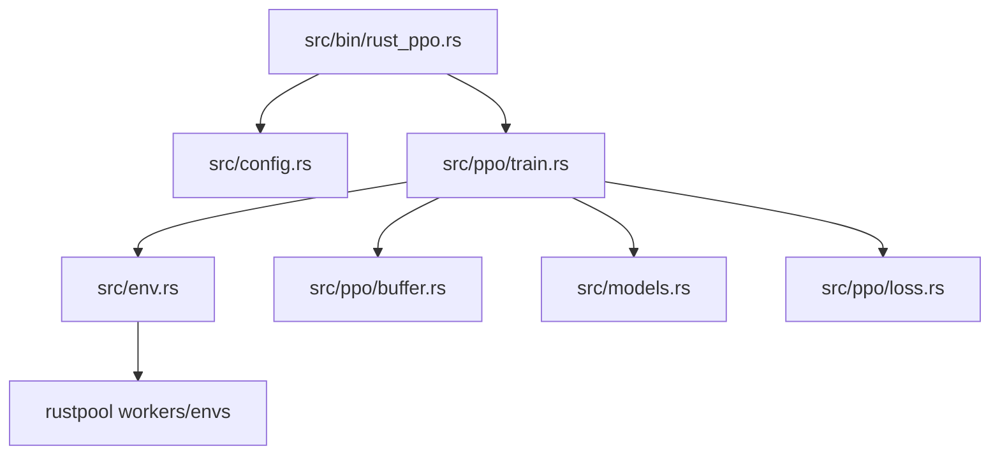
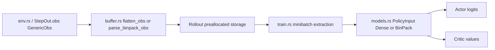

# Architecture

This page explains static structure: module boundaries, dependency direction, and data contracts.
For runtime update order and algorithm flow, see [Training Loop](training-loop.md).

## Module map

- `src/bin/rust_ppo.rs`: process bootstrap, tracing formatter, backend/device setup, distributed registration.
- `src/config.rs`: argument schema, YAML merge, CLI override logic, distributed env fallback.
- `src/env.rs`: async sharded env pool (`AsyncEnvPool`) over rustpool workers.
- `src/ppo/train.rs`: PPO orchestration (rollout, GAE, optimization, eval).
- `src/ppo/buffer.rs`: rollout storage, flattening/parsing, minibatch extraction.
- `src/models.rs`: actor/critic networks and unified policy/value input dispatch.
- `src/ppo/loss.rs`: PPO loss terms and categorical sampling utilities.

## Dependency graph (what depends on what)

Source pointers:

- Bootstrap -> train handoff: [src/bin/rust_ppo.rs](../src/bin/rust_ppo.rs#L190)
- Config dependency: [src/config.rs](../src/config.rs#L257)
- Training hub dependencies: [src/ppo/train.rs](../src/ppo/train.rs#L325)
- Env integration layer: [src/env.rs](../src/env.rs#L32)
- Buffer contracts: [src/ppo/buffer.rs](../src/ppo/buffer.rs#L33)
- Model input contracts: [src/models.rs](../src/models.rs#L374)
- Loss primitives: [src/ppo/loss.rs](../src/ppo/loss.rs#L1)

### Dependency notes

- `train.rs` is the orchestration hub and has the highest integration surface.
- `env.rs` depends on rustpool contracts (`GenericObs`, worker messages, env step/reset semantics).
- `buffer.rs` defines shape/memory contracts consumed by `train.rs` and `models.rs`.
- `models.rs` depends on tensor shape guarantees from `train.rs`/`buffer.rs`.

## Change impact map

Use this map before editing:

- Change in env observation keys/order -> update `parse_binpack_obs`/`flatten_obs`, then geometry docs.
- Change in action space cardinality -> update mask handling and actor output expectations.
- Change in rollout storage layout -> update minibatch extraction and model input assembly.
- Change in model input signatures -> update `PolicyInput` callsites in training and eval.
- Change in done/reset semantics -> validate One Strike behavior and troubleshooting docs.

Fast jump links:

- Observation parsing: [src/ppo/buffer.rs](../src/ppo/buffer.rs#L33)
- Policy input dispatch: [src/models.rs](../src/models.rs#L402)
- Rollout and optimization loops: [src/ppo/train.rs](../src/ppo/train.rs#L325)
- Worker done/reset behavior: [rustpool worker loop](../../rustpool/src/core/worker.rs#L28-L42)

## Data Geometry

This is the highest-risk integration surface: data travels from `GenericObs` to rollout memory to model tensors.

### End-to-end shape flow

| Stage | Maze-v0 | BinPack-v0 |
|---|---|---|
| `env.rs` output (`GenericObs`) | `ArrayData::Float32([2])` for agent position | `items:[max_items,3]`, `ems:[max_ems,6]`, `items_mask:[max_items]`, `placed_mask:[max_items]`, `ems_mask:[max_ems]`, plus locations |
| `buffer.rs` ingest | `flatten_obs` -> contiguous `[obs_dim]` | `parse_binpack_obs` -> validated slices for items/ems/valid masks |
| Rollout storage | `obs: [T * N * obs_dim]` | `items: [T * N * max_items * 3]`, `ems: [T * N * max_ems * 6]`, validity bit-vectors |
| Model input | `PolicyInput::Dense { obs: [B, obs_dim] }` | `PolicyInput::BinPack { ems:[B,max_ems,6], items:[B,max_items,3], pad masks:[B,*], valid:[B,*] }` |
| Actor output | logits `[B, action_dim]` | logits `[B, max_items * max_ems]` |
| Critic output | values `[B, 1]` | values `[B, 1]` |

### Geometry diagram

## Unified policy input boundary

The training loop now calls `Agent::policy_value` / `actor_logits` / `critic_values` with typed inputs:

- `PolicyInput::Dense { obs }`
- `PolicyInput::BinPack { ems, items, ems_pad_mask, items_pad_mask, ems_valid_f32, items_valid_f32 }`

This keeps task-specific tensor branching inside model-facing API boundaries instead of scattered call sites.

Source pointers:

- Unified input enums and dispatch: [src/models.rs](../src/models.rs#L374-L440)
- Call sites in train/eval: [src/ppo/train.rs](../src/ppo/train.rs#L486-L777)

## Worker sharding model

`AsyncEnvPool` shards env ids across worker threads (`env_id % num_threads`).

- `reset_all(seed)` sends deterministic per-env seed map (`seed + env_id`).
- `step_all(actions)` routes each action to owning shard.
- Workers return `StepResult` with `obs`, `reward`, `done`, `action_mask`.

Source pointers:

- Pool implementation: [src/env.rs](../src/env.rs#L32-L141)
- rustpool worker behavior: [rustpool worker loop](../../rustpool/src/core/worker.rs#L28-L67)

See also [Training Loop](training-loop.md) for runtime sequence and [Troubleshooting](troubleshooting.md) for done/reset semantics.
