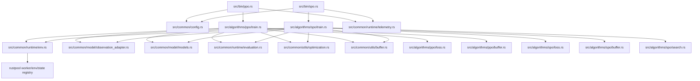

# Architecture

This document defines crate boundaries, dependency direction, and cross-module contracts for both binaries:

- PPO (`ppo`)
- SPO (`spo`)

For runtime step-by-step behavior, see:

- PPO: [training-loop.md](training-loop.md)
- SPO: [spo-training-loop.md](spo-training-loop.md)

Source folder guides:

- [src/README.md](https://github.com/Hata41/rust_ppo/blob/main/src/README.md)
- [src/algorithms/README.md](https://github.com/Hata41/rust_ppo/blob/main/src/algorithms/README.md)
- [src/common/README.md](https://github.com/Hata41/rust_ppo/blob/main/src/common/README.md)

## Crate boundaries

### `rust_rl` responsibilities

- Config parsing and precedence merge
- Per-binary config loaders (`PpoArgs`, `SpoArgs`)
- Environment process orchestration via `AsyncEnvPool`
- PPO and SPO trainers + optimizer phases
- Trait-based observation adaptation (`ObservationAdapter`)
- Shared deterministic evaluator
- Shared telemetry context and formatter
- Snapshot lifecycle accounting at trainer-side pool boundary

### `rustpool` responsibilities

- Environment implementations (`Maze`, `BinPack`)
- Worker loop semantics (`step`, `reset`, `snapshot` transport)
- Snapshot state storage backend (`StateRegistry`)

Boundary rule:

- `rustpool` remains backend provider of snapshot storage APIs.
- `rust_rl` owns live snapshot accounting discipline (`snapshot/simulate/release` bookkeeping).

## Module map

Core modules in `rust_rl`:

- `src/bin/ppo.rs`: PPO bootstrap + backend selection + `TrainingContext` init
- `src/bin/spo.rs`: SPO bootstrap + backend selection + `TrainingContext` init
- `src/common/config.rs`: shared schema + YAML/CLI merge + per-binary loaders
- `src/common/runtime/env.rs`: async env pool, worker routing, snapshot lifecycle integration, env registry
- `src/common/model/observation_adapter.rs`: trait-based observation adapters (`DenseObservationAdapter`, `BinPackObservationAdapter`)
- `src/common/model/models.rs`: actor/critic definitions and architecture-aware construction
- `src/common/runtime/evaluation.rs`: shared evaluation loop scaffold
- `src/common/utils/optimization.rs`: shared LR decay + gradient clipping helpers
- `src/common/utils/buffer.rs`: shared buffer flattening/storage helpers
- `src/common/runtime/telemetry.rs`: shared formatter/MLflow/OTLP wiring and `TrainingContext`
- `src/algorithms/ppo/*`: PPO-specific buffer/loss/training
- `src/algorithms/spo/*`: SPO-specific search/buffer/loss/training

## High-level dependency graph

## Configuration contract

Both binaries deserialize the same schema (`FileConfig`) but load through dedicated wrappers:

- `PpoArgs::load()`
- `SpoArgs::load()`

Compatibility points:

- Canonical section name: `training_core`
- Backward-compatible alias: `ppo_core`
- Optional explicit adapter key: `architecture.observation_adapter`

PPO decoupling rule:

- PPO loader strips `spo` section before strict deserialization so PPO runtime does not implicitly depend on SPO-only config payloads.

## Observation adapter contract (`env_model`)

`src/common/model/observation_adapter.rs` is the shared tensor-construction boundary for PPO/SPO/search.

Responsibilities:

- Resolve adapter from config (`observation_adapter`) with metadata fallback
- Infer effective observation dimension
- Build actor/critic/policy inputs from `GenericObs` batches
- Build BinPack policy input from PPO minibatch parts
- Signal architecture needs (`uses_binpack_architecture`)

Invariants:

- Adapter output must match input enums in `models.rs`.
- BinPack item/EMS tensor shapes must remain unchanged.
- Observation parsing assumptions must remain aligned with rustpool output.

## Environment registry contract

`src/common/runtime/env.rs` now uses a registry pattern instead of hardcoded task matching.

- Built-ins are registered at startup (`Maze-v0`, `BinPack-v0`).
- New tasks can be added via `register_env_factory(...)` without modifying core switch logic.

## Snapshot lifecycle and ownership boundary

Flow:

1. `AsyncEnvPool::snapshot` requests snapshots from worker-owned envs and stores cloned envs through `StateRegistry`.
2. Search/simulation uses `simulate_batch` against cloned states.
3. Callers release state ids with `release_batch`.
4. Pool drop performs final release for any locally tracked ids.

Ownership contract:

- `StateRegistry` stores/removes cloned states.
- `AsyncEnvPool` tracks active state ids locally and guarantees counter/accounting correctness.

## Telemetry architecture

Both binaries initialize telemetry through `TrainingContext::initialize(...)`.

Shared categories:

- `TRAINER`
- `ACTOR`
- `EVALUATOR`
- `MISC`

PPO and SPO emit compatible evaluation schema keys for downstream dashboards.

## Maintenance checklist

When modifying internals:

- If env observation schema changes, update adapter implementations, trainers, search path, and docs together.
- If snapshot lifecycle calls change, verify accounting ownership remains in `rust_rl`.
- If logging keys/categories change, maintain PPO/SPO schema compatibility.
- If config keys change, update `src/common/config.rs`, template YAML files, and docs together.
